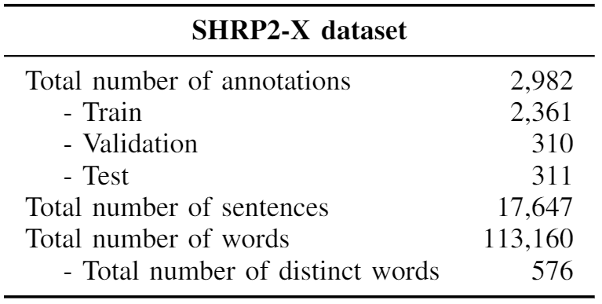
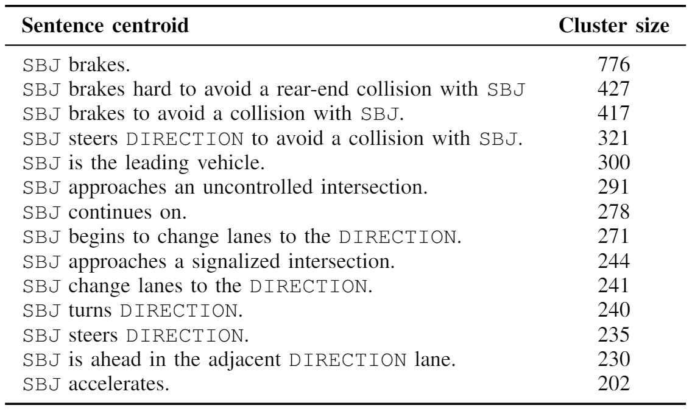
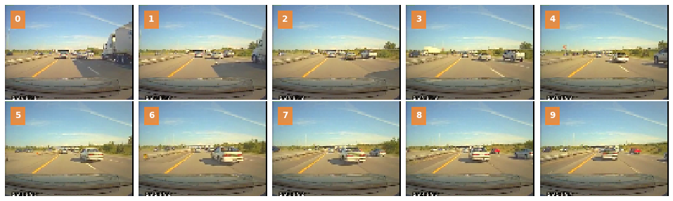
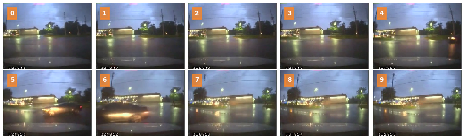
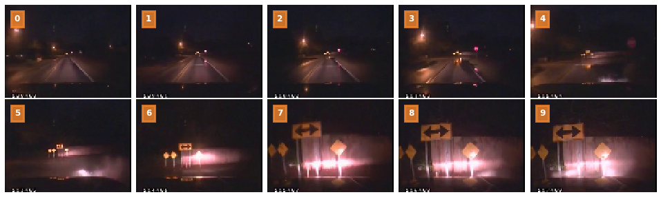

# SHRP2-eXplained (SHRP2-X)

This repository contains a set of annotations on top of SHRP2 NDS dataset that provide a multi-sentence textual description of the event. 
To get access to the dataset, please refer to the  [SHRP2 NDS website](https://www.shrp2nds.us/index.html).

### IMPORTANT: The dataset will be released upon paper acceptance.

### Annotations overview

The SHRP2 dataset is a collection of more that 8800 safety-critical events, gathered by more than 3300 drivers between 2010 and 2013.
The dataset comes with multiple videos recording the event from different angles, *eg*, front-facing, rear-facing and driving-facing.
We annotated a portion of those videos with a textual description considering only what was visible from the front facing camera, as it is the most common and widely used set up in many commercial scenarios.

We annotated the sample of the dataset with a set of temporally ordered sentences, with a subject-predicate structure.
The subject is generally the subject vehicle `SV`, other vehicles in the scenes (indicated with `V2`, `V3`, `V4`) or other actors, as pedestrian, bicycles, animal, objects).
The predicate, instead, is composed by a single verb (*ie*, action) at present simple tense, followed by its dependents.

Generally, the list of sentence for each annotation includes:
* one or more sentences describing the environment, *eg*,  the presence of an intersection or a stop sign, the presence and position of other relevant vehicles or actors in the scenes; 
* one or more sentences describing the events or the maneuvers computed by the various subjects, *eg*, change of lanes, going through an intersection, traffic light change, loss of control of a vehicle;
* one or more sentences describing the event itself or the reactions that the actors involved had with respect to it, *eg*, braking, steering in the adjacent lane; 
* one or more sentences describing what happened after the event, *eg*, the actors continuing driving or remaining stopped.

### Annotations Statistics

We annotated roughly 3000 samples of the original dataset, with a total of 17,647 sentences and 113,160 words.
Hovever, as the number of verbs and noun describing the event on the roadway is limited, the total number of distinct words is fairly small, 576.
Below, a table with some statistics on the dataset.

To give a glimpse of the content of the dataset, we are reporting the results of a clustering over the sentences composing the annotations.
As we are interested in highlighting what happens in a given sentence, we replaced the instance-specific part of a sentence with placeholder, *eg*, replacing the actors (`SV`, `V2`, `V3`, `V4`) with `SBJ`, the direction (left, right) with `DIRECTION`.
The result is the following:

### Examples

Below, some example of annotations you will find in the dataset. The sample images have been anonimized.

#### Other vehicle lane change

V2 is ahead in the right adjacent lane. V2 begins to change lanes to the left. SV has to brakes hard to avoid a collision with V2. Both vehicle continue traveling in now shared lane.

#### Subject vehicle turn

V2 is ahead in the right adjacent lane. V2 begins to change lanes to the left. SV has to brakes hard to avoid a collision with V2. Both vehicle continue traveling in now shared lane.

#### Subject vehicle loss of control

SV approaches an intersection controlled by a stop sign. SV loses control of the vehicle. SV begins to slides forward. SV brakes. SV regains control of the vehicle. SV stops.

